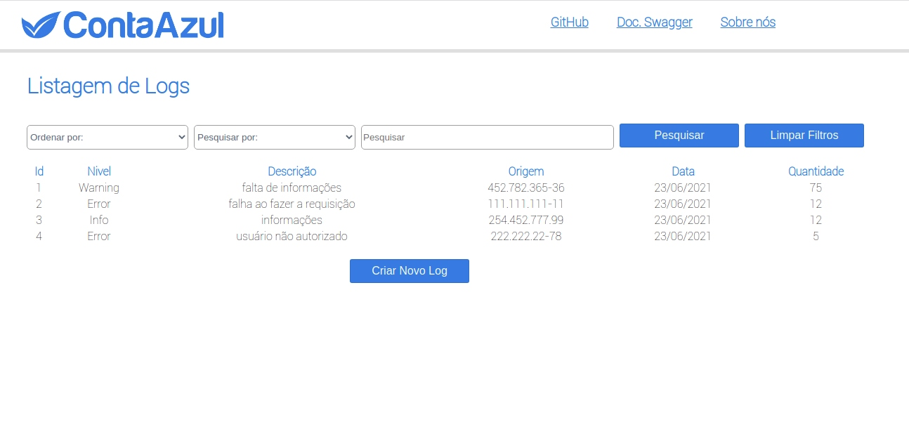
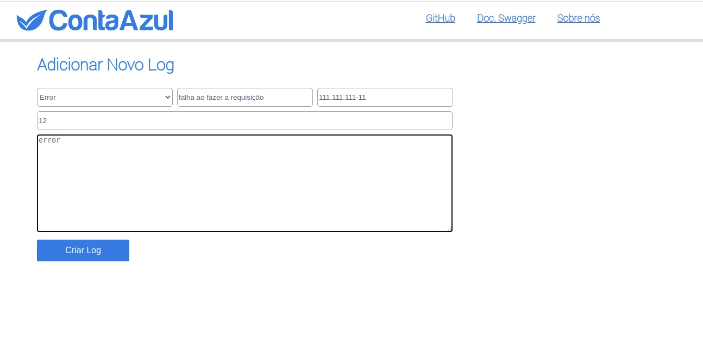
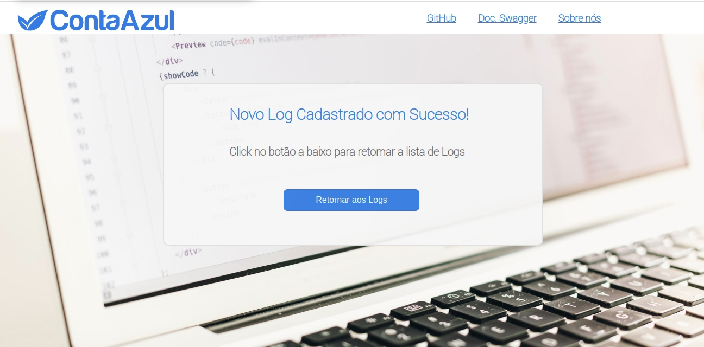

## Central de erros Front-end.

Esse projeto foi desenvolvido para a aceleração de JAVA da qual participei.
Aqui irá encontrar a parte de front-end que esta sendo consumida em tempo real de um deploy na plataforma da Heroku. 

---

#### O que é a aplicação:

É o front-end para uma central que cadastra erros em um api, podendo filtra-los, cadastra-los e ordena-los como preferir por seus campos. 

#### Tecnologias usadas:

##### O Front-end
  * Foi desenvolvido usando React
  * React Router Dom 

##### O Back-end
  * Foi desenvolvido em Java (mais detalhes no repositorio do back-end).

  [Link do Repositorio do back-end.](https://github.com/Melissa-gomes/Central-de-erros-back-end)

#### Telas desenvolvidas:

#### *Login*

#### *Cadastro de Usuario*

#### *Retorno de um Cadastro bem sucedido*

#### *Tabela com todos os logs de erros*

#### *Cadastro de um novo log*

#### *Retorno de um log cadastrado com sucesso*

